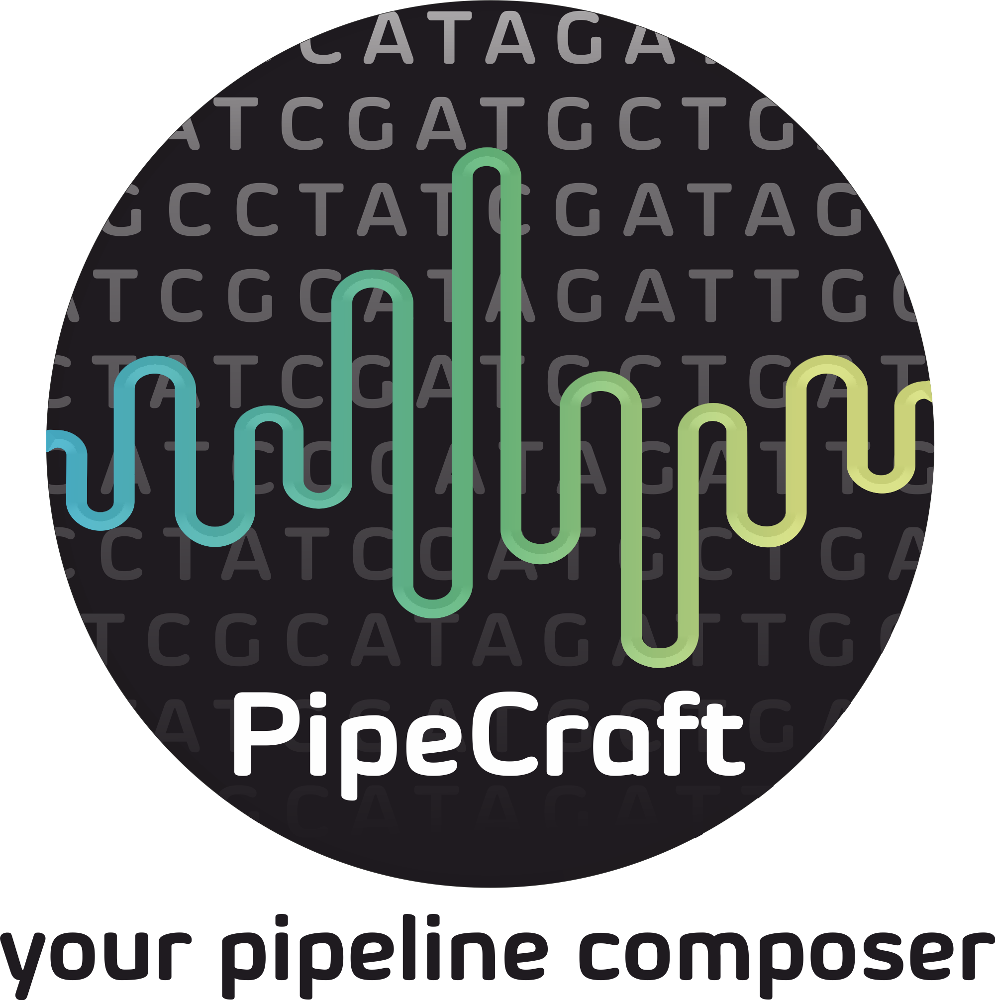

# PipeCraft2 

PipeCraft2 is a user-friendly GUI software for metabarcoding data analysis. It provides:
- Ready-to-run pipelines for common metabarcoding workflows
- Individual analysis modules for custom workflows
- Integration with popular bioinformatics tools

## Quick Start

### For Users

📥 [Download Latest Release (v1.0.0)](https://github.com/pipecraft2/pipecraft/releases/tag/v1.0.0)

📚 [User Guide](https://pipecraft2-manual.readthedocs.io/en/latest/)

### For Developers

Pre-built Docker images available on [DockerHub](https://hub.docker.com/u/pipecraft).

📚 [Developer Guide](https://pipecraft2-manual.readthedocs.io/en/1.0.0/for_developers.html)

#### Prerequisites

- [NodeJS](https://nodejs.org/en/download/) (make sure to install `build tools` on Windows, or `build-essential` on Ubuntu)
- [Yarn package manager](https://classic.yarnpkg.com/en/docs/install/#windows-stable)
- [Docker](https://www.docker.com/get-started)
- [Git](https://git-scm.com/downloads)

#### Installation

```bash
# Clone the repository
git clone https://github.com/pipecraft2/pipecraft
cd pipecraft

# Install dependencies and setup PipeCraft
yarn run install_pipe

# Start PipeCraft in development mode
yarn electron:serve
```
